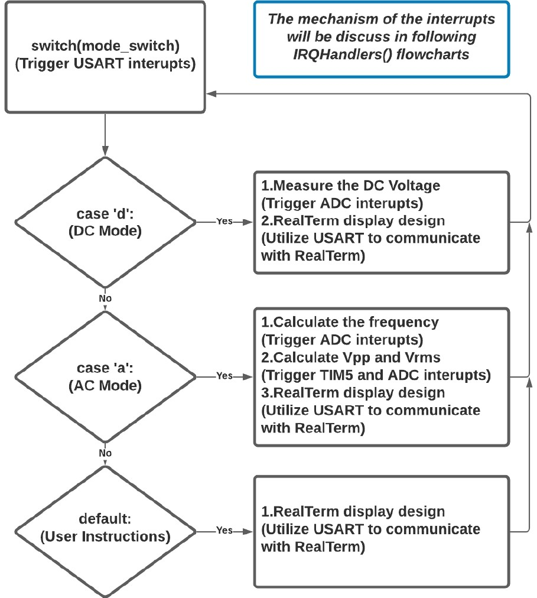
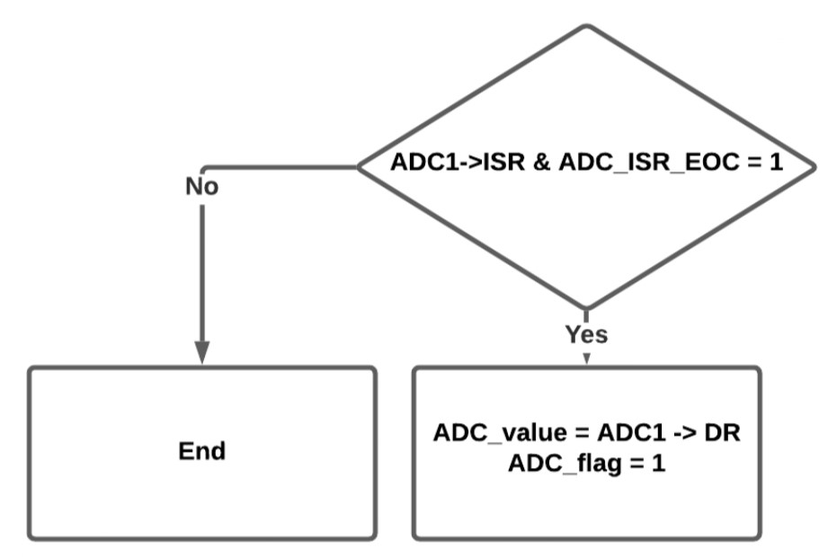
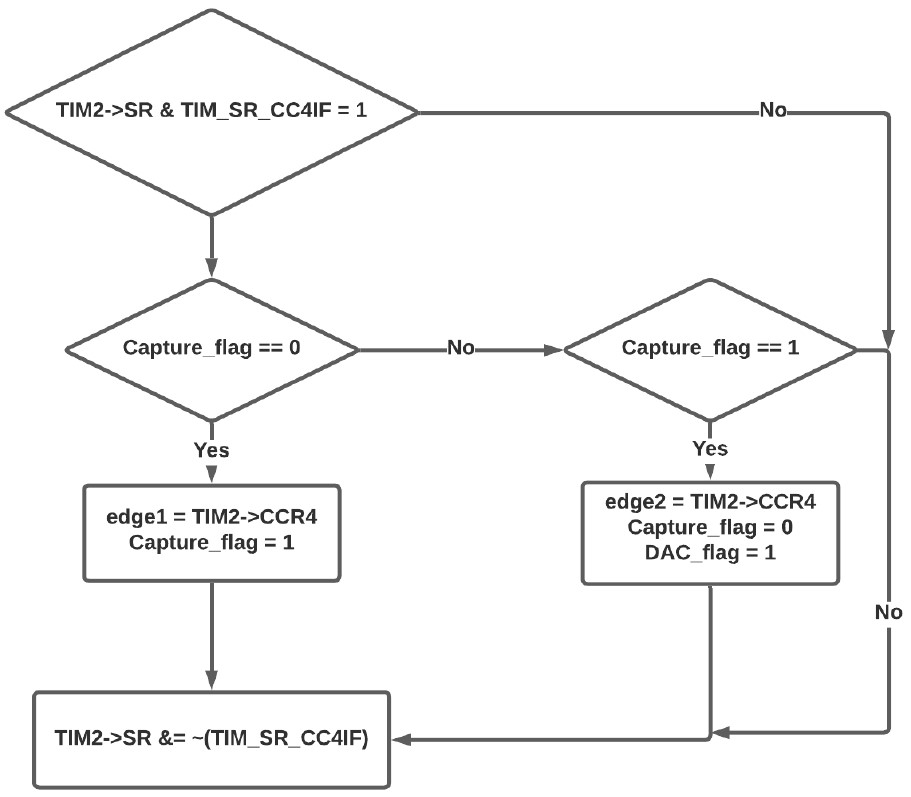
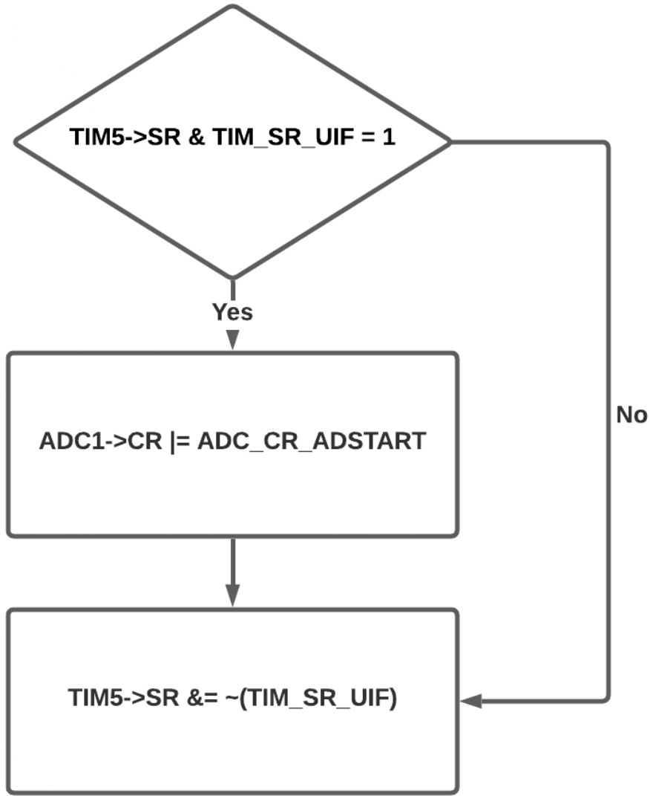
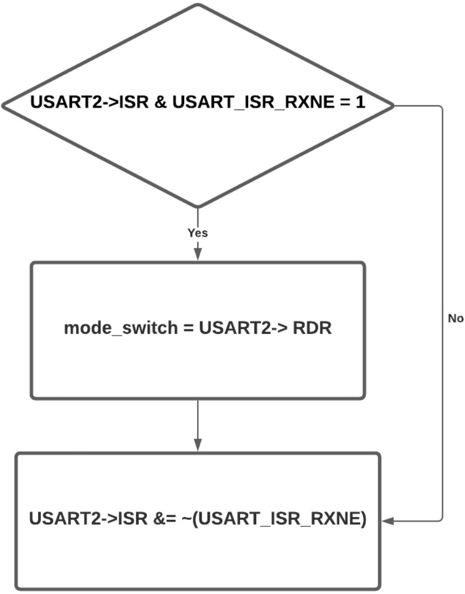
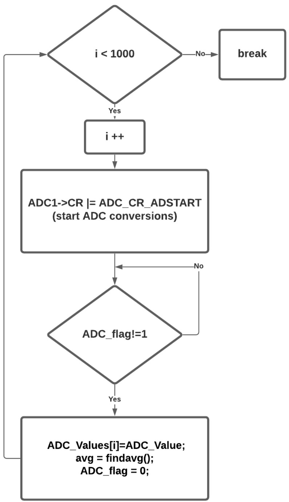
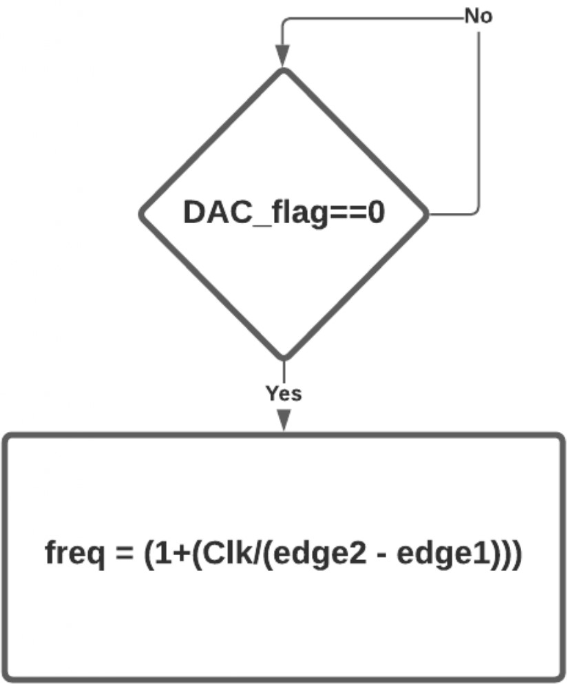
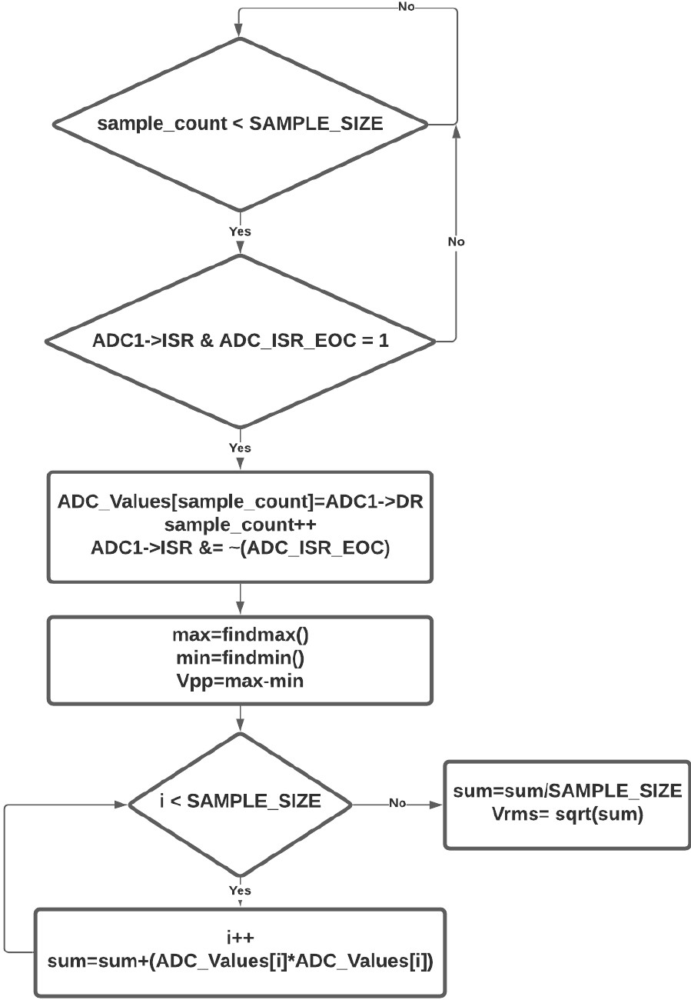

# Multimeter

# Project Introduction
This is a digital multimeter. It has a DC measure mode and an AC measure mode. It can handle inputs between 0 and 3 volts.  It is capable of reading waves with frequency from 1-1000 Hz. It can read sin, saw-tooth, square, and triangle waves. In DC mode, it reads the voltage level and outputs the corresponding voltage to the terminal. In AC mode it reads the frequency, peak to peak voltage, RMS voltage. When outputting to the terminal the device both displays the values numerically and it displays the values on a series of bar graphs. 

# Table of Contents
* [Accomplishments](#accomplishments)
* [System Specification](#system-specification)
* [Schematic](#schematic)
* [How the code works?](#software-architecture)

# Accomplishments
* Created the multimeter’s AC/DC interface on Realterm through USART, USART’s interrupts.
* Calculated input signals’ Vpp and Vrms through sampling its voltages via ADC interrupt.
* Calculated the time interval between each ADC interrupt according to the frequency of the input signal to avoid over-sampling or under-sampling.
* Calculated the frequency of the input signal based on the interval between the two consecutive rising edges of the square wave that is generated by the comparator and the edges are captured by the timer’s interrupts.
* Generated the required square wave by configuring the DAC output value as the average voltage of the input signal and setting it as the reference voltage of the comparator.

# System Specification

| Parameter | Value | Unit |
| :-----------:  | :-----------: |:-----------: |
| Voltage input| 0-3 | Volts |
| Input type |DC or most types of AC|---|
| Input frequency | 0 or 1-1000 |Hz|
| Freq_out error | +-max(5, 1% of freq) |Hz|
| Voltage our error| +- .25 |V|
| Data points used to read |1000|Points/period|
| Current input necessary | 300 |mA|
| Power source | USB |---|
| User interface | USART Terminal |---|
| Suggested scope probe setting | 1x |---|

# Schematic

  

# Software Architecture
* Main Function: 
Our main function has three cases, a default where the user picks between AC and DC voltage, then the AC measure and the DC measure. It chooses between them using a USART interrupt based on a key press from the user. In dc mode it measures and calculates the DC voltage (discussed later) then prints the result to the terminal. When printing to the terminal it prints DC then makes a bar graph by printing “0v” on colunm 0, “1v” on column 20, “2v” on column 40, and “3v” on column 60, on the next row it prints 60 columns of dashes. Finally, it converter the voltage to a corresponding number of columns out of 60 (3v =60 columns) and prints that many columns worth of “x” on the next row. The printing for all the bar graphs work in exactly this way. Once we print the values and everything we loop back to the beginning of the DC measurement procedure.  
In AC mode we first calculate the frequency. To do this we measure the wave form as many times as possible in .25 seconds (we want to measure at least a quarter of the wave when the wave is at its slowest). Using the max and min values (we find in real time) from that we calculate the middle value and write the DAC to output that value. The comparator then compares the wave and that DAC value to produce a square wave with frequency equal to the input wave form. Next, we initialize timer 2 to capture rising edges of that wave form and set up its interrupt to get two consecutive rising edges. From those edges we are able to calculate the frequency. We use USART to print the frequency to the terminal. Next, we use that frequency to calculate what frequency we want to use timer 5 to measure the wave. The idea is to get 1000 points on the wave regardless of the wave’s frequency. Then we use those 1000 points to calculate Vpp and Vrms. Finally, we print those values and their bar graphs to the terminal and loop back through. 

  

* ADC_IRQ_Handler: 
We hop into the ISR, if the EOC flag is what got us in there we’ll do some stuff, if not we end.
The stuff we do is read the value from the ADC register. This also clears the ADC EOC flag. Then we set another flag which we use in main to make the program wait until the ADC is done and we can move on using the ADC_value. 

  

* TIM2_IRQ_Handler: 
We hop into the ISR, if the capture flag from CCR4 is what got us in there we’ll do some stuff, if not we end. Then we branch depending on the “capture flag.” This flag indicates when we’re doing our second capture. Its 0, we’re doing the first capture so we get the value from CCR4 and put it in a variable called edge1. We set capture flag because we’ve gotten the first capture. Capture flag is 1, we’re on our second capture so we put the value in variable edge2. We clear the flag for next time. And we set DAC_flag to 1. This flag indicates that we’re done capturing, to our main function. At the end we always clear the interrupt  flag that got us in.  

  

* TIM5_IRQ_Handler: 
We hop into the ISR, if the flag from ARR rolling over is what got us in there we’ll do some stuff, if not we end. All we do is start the ADC. This lets us start the ADC at precise time intervals. At the end we clear the interrupt flag that got us in there. 
To calculate the ARR value we put into the timer 5 we need the wave’s frequency, the clock speed and the number of points we want to measure per wave period. The later two values are constants we set at the beginning and the frequency is measured and calculated before we enable the timer 5.  

  

* USART2_IRQ_Handler: 
We hop into the ISR, if the flag from a USART receive is what got us in there we’ll do some stuff, if not we end. We get the received key out of the RDR reg, and use it to decide where we go in our switch case statements. This lets us decide between reading AC and DC voltages. 

  

* DC Voltage Measure: 
To get the DC voltage, we measure it 1000 times with the ADC. The amount of time this takes works out to be about 13 ms (within the bounds of the assignment even if it takes 10x less time or ~10x more time than we expect). To perform this, we turn on the ADC start, wait until its done, and put the resulting value into our array. At the end we get the average value of the array and this is our DC voltage. 

  

* Frequency Calculation: 
To calculate the frequency we wait until the DAC_flag is zero (this indicates that both edge values have been assigned with values corresponding to the rising edges of our square wave. We are then able to get the number of clock cycles between the two rising edges and divide the internal clock frequency by that number. We experience some rounding error for some reason so we add 1 to the final number to get the frequency. 

  

* Vrms & Vpp Calculations: 
We loop through the number of times equal to our sample size. At appropriate intervals set by timer 5 we get the ADC value and put it into our array. The timer starts the ADC at appropriate intervals so we just wait for the ADC to get done each iteration (we cycle between first and second branch block while waiting). Once the ADC is started by the timer 5 interrupt and it finishes its work, we throw the ADC’s result into an array of size equal to “SAMPLE_SIZE.” We then increment the index and go back to the top, waiting for another timer interrupt and the ADC to be done. Once we have all the samples we want in the array, we get the max and min out of the array with some predefined functions. Vpp is calculated by the max value- the min value. Next to get Vrms, we loop through each index in that array and accumulate each value squared. Once thats done we divide the accumulated sum by the number of samples and square root that number to get Vrms. Vpp and Vrms need to be converted from ADC output values to something that corresponds to an actual voltage. We preform that conversion before printin the values to the terminal.  

  

# Demonstration
